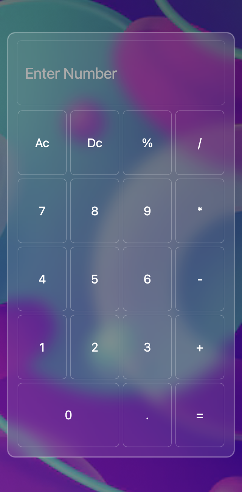

# 🔮 Glassmorphism Calculator

A modern, fully functional calculator built using **HTML**, **CSS** (with elegant **Glassmorphism UI**), and **JavaScript**. Lightweight and responsive — built with a focus on clean and minimal code.

> ✅ **Only 25 lines of JavaScript** power the entire logic!

---

## 📸 Demo

**🔗 Live Demo:** [View Project](https://madhu-naggari.github.io/calculatorApp/)


---

## 🧠 Features

- 🎨 Glassmorphism design for a sleek modern look  
- ✅ Fully functional calculator (Add, Subtract, Multiply, Divide)  
- ⚡ Just **25 lines of JavaScript** (clean and efficient)  
- 📱 Responsive design for desktop and mobile  
- 🧼 Minimal and accessible UI  
- 🧩 Built with only HTML, CSS, and JavaScript  

---

## 📱 Responsive Preview

### 🖥️ Desktop View  


---

### 📱 Mobile View  


---

## 🛠️ Tech Stack

| Tech         | Purpose                         |
|--------------|----------------------------------|
| HTML         | Structure of the calculator      |
| CSS          | Styling with glassmorphism effect |
| JavaScript   | Calculator logic (in 25 lines!)  |

---

## 🚀 Getting Started

### 1. Clone the Repository
```bash
git clone https://github.com/Madhu-Naggari/calculatorApp.git
cd glassmorphism-calculator
```
---
### 2. Open in Browser

Just open index.html in your preferred browser.

Or deploy with:
 
- GitHub Pages
- Netlify
- Vercel
- Any static site hosting

---

💡 Code Philosophy

“Anyone can write code in many lines.
But not everyone can focus on avoiding unwanted code.”

This calculator was built with a clean coding approach in mind:
	•	Minimal DOM interactions
	•	No unused logic
	•	Elegant and efficient

The entire calculator works with just 25 lines of JavaScript, making it easy to understand, maintain, and scale.
